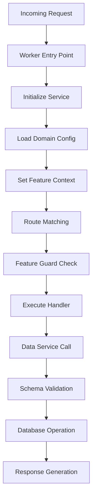
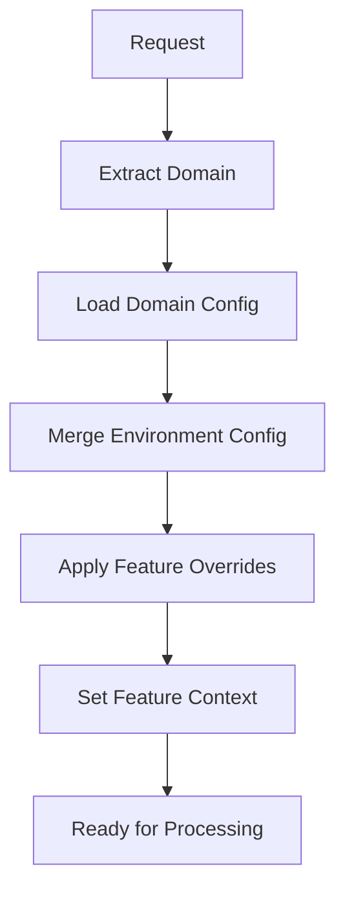
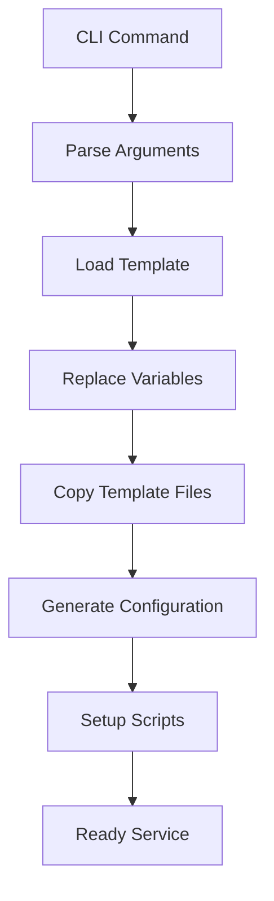

# Architecture Overview

## 🏛️ Framework Architecture

The Clodo Framework follows a **layered architecture** designed for scalability, maintainability, and developer productivity. Each layer has specific responsibilities and provides clear interfaces to adjacent layers.

```
┌─────────────────────────────────────────────────────────────┐
│                    Service Layer (User Code)                │
├─────────────────────────────────────────────────────────────┤
│                   Framework Integration                     │
│  ┌─────────────────┐ ┌─────────────────┐ ┌─────────────────┐│
│  │ Worker Helpers  │ │ Feature Guards  │ │ Router System   ││
│  └─────────────────┘ └─────────────────┘ └─────────────────┘│
├─────────────────────────────────────────────────────────────┤
│                    Business Logic Layer                     │
│  ┌─────────────────┐ ┌─────────────────┐ ┌─────────────────┐│
│  │ Route Handlers  │ │ Data Services   │ │ Module Manager  ││
│  └─────────────────┘ └─────────────────┘ └─────────────────┘│
├─────────────────────────────────────────────────────────────┤
│                   Configuration Layer                       │
│  ┌─────────────────┐ ┌─────────────────┐ ┌─────────────────┐│
│  │ Domain Config   │ │ Feature Flags   │ │ Schema Manager  ││
│  └─────────────────┘ └─────────────────┘ └─────────────────┘│
├─────────────────────────────────────────────────────────────┤
│                     Platform Layer                          │
│  ┌─────────────────┐ ┌─────────────────┐ ┌─────────────────┐│
│  │ Cloudflare      │ │ D1 Database     │ │ Worker Runtime  ││
│  │ Workers         │ │                 │ │                 ││
│  └─────────────────┘ └─────────────────┘ └─────────────────┘│
└─────────────────────────────────────────────────────────────┘
```

## 🔧 Core Components

### **1. Configuration System**

**Location**: `src/config/`

The configuration system provides domain-aware, multi-tenant configuration management with runtime feature flags.

#### **Domain Configuration (`domains.js`)**
```javascript
// Manages multi-domain, multi-environment configuration
const domainConfig = {
  name: 'my-client',
  accountId: 'cloudflare-account-id',
  zoneId: 'cloudflare-zone-id',
  domains: {
    production: 'api.myclient.com',
    staging: 'staging-api.myclient.com',
    development: 'dev-api.myclient.com'
  },
  features: {
    authentication: true,
    premiumFeatures: false,
    analytics: true
  },
  settings: {
    environment: 'production',
    logLevel: 'info',
    corsOrigins: ['https://myclient.com']
  }
};
```

#### **Feature Flag Manager (`features.js`)**
```javascript
// Runtime feature management with domain context
class FeatureFlagManager {
  setDomain(domainConfig);           // Set domain context
  isEnabled(featureName);            // Check feature status
  setGlobalOverride(feature, bool);  // Override feature globally
  createToggle(feature, onFn, offFn); // Create conditional handlers
}
```

**Key Capabilities**:
- ✅ Domain-specific feature configuration
- ✅ Global feature overrides for testing
- ✅ Runtime feature toggling
- ✅ Environment-based configuration merging
- ✅ Configuration validation and type checking

### **2. Data Layer**

**Location**: `src/services/`, `src/schema/`

Provides generic CRUD operations with schema validation and automatic SQL generation.

#### **Generic Data Service (`GenericDataService.js`)**
```javascript
class GenericDataService {
  constructor(d1Client, modelName);
  
  // CRUD Operations
  async create(data);                    // Create with validation
  async findById(id);                    // Find single record
  async find(criteria, options);         // Find with criteria
  async update(id, updates);             // Update with validation
  async delete(id);                      // Soft/hard delete
  async paginate(criteria, pagination);  // Paginated results
}
```

#### **Schema Manager (`SchemaManager.js`)**
```javascript
class SchemaManager {
  registerModel(name, schema);           // Register data model
  validateData(modelName, data);         // Validate against schema
  generateSQL(modelName, operation, data); // Auto-generate SQL
  getModel(modelName);                   // Retrieve model definition
}
```

**Key Capabilities**:
- ✅ Automatic CRUD API generation
- ✅ Schema-based data validation
- ✅ SQL query generation and optimization
- ✅ Pagination and filtering support
- ✅ Type-safe database operations

### **3. Routing System**

**Location**: `src/routing/`, `src/handlers/`

Provides automatic route generation with parameter matching and middleware support.

#### **Enhanced Router (`EnhancedRouter.js`)**
```javascript
class EnhancedRouter {
  constructor(d1Client, options);
  registerRoute(method, path, handler);  // Custom route registration
  handleRequest(method, path, request);  // Route matching and execution
  _registerGenericRoutes();             // Auto-generate CRUD routes
}
```

#### **Generic Route Handler (`GenericRouteHandler.js`)**
```javascript
class GenericRouteHandler {
  constructor(d1Client, modelName, options);
  
  // HTTP Method Handlers
  async handleList(request);     // GET /api/model
  async handleCreate(request);   // POST /api/model  
  async handleGet(request, id);  // GET /api/model/:id
  async handleUpdate(request, id); // PATCH /api/model/:id
  async handleDelete(request, id); // DELETE /api/model/:id
}
```

**Key Capabilities**:
- ✅ Automatic REST API generation
- ✅ Parameter extraction and validation
- ✅ Authentication and authorization hooks
- ✅ Custom route registration
- ✅ Middleware pattern support

### **4. Worker Integration**

**Location**: `src/worker/`

Provides Cloudflare Workers-specific integration patterns and helpers.

#### **Service Initialization (`integration.js`)**
```javascript
// Initialize service with domain context
const initializeService = (env, domainConfigs) => {
  const domainConfig = getDomainFromEnv(env, domainConfigs);
  featureManager.setDomain(domainConfig);
  return {
    domain: domainConfig.name,
    environment: env.ENVIRONMENT,
    features: featureManager.getEnabledFeatures(),
    config: createEnvironmentConfig(domainConfig, env.ENVIRONMENT)
  };
};
```

#### **Feature Guards (`integration.js`)**
```javascript
// Conditional request handling based on feature flags
const createFeatureGuard = (featureName, options = {}) => {
  return (handler) => {
    return async (request, env, ctx) => {
      if (!featureManager.isEnabled(featureName)) {
        return options.fallbackResponse || new Response('Not Found', { status: 404 });
      }
      return handler(request, env, ctx);
    };
  };
};
```

**Key Capabilities**:
- ✅ Domain-aware service initialization
- ✅ Feature-gated request handling
- ✅ Environment detection and configuration
- ✅ Worker lifecycle management
- ✅ Error handling and logging integration

### **5. Module System**

**Location**: `src/modules/`

Extensible plugin architecture for custom functionality and cross-cutting concerns.

#### **Module Manager (`ModuleManager.js`)**
```javascript
class ModuleManager {
  registerModule(name, module);          // Register custom modules
  executeHooks(hookName, context);       // Execute lifecycle hooks
  getModule(name);                       // Retrieve registered modules
}
```

**Hook Points**:
- `before.request` - Before request processing
- `after.request` - After request processing  
- `before.create` - Before data creation
- `after.create` - After data creation
- `before.auth` - Before authentication
- `after.auth` - After authentication

## 🔄 Data Flow

### **1. Request Processing Flow**



### **2. Configuration Resolution**



### **3. Service Generation Flow**



## 📦 Module Dependencies

### **Core Dependencies**
```javascript
// Framework internal dependencies
import { featureManager } from './config/features.js';
import { schemaManager } from './schema/SchemaManager.js';
import { moduleManager } from './modules/ModuleManager.js';
```

### **External Dependencies**
```json
{
  "dependencies": {
    "wrangler": "^3.0.0"  // Cloudflare Workers CLI
  },
  "peerDependencies": {
    "@cloudflare/workers-types": "^4.0.0"  // TypeScript types
  }
}
```

### **Runtime Requirements**
- **Cloudflare Workers Runtime**: 2023-05-18 or later
- **D1 Database**: Beta or production
- **Node.js**: 18.0.0 or later (for development)

## 🔐 Security Architecture

### **Multi-Tenant Isolation**
```javascript
// Domain-based request isolation
const service = initializeService(env, domains);
// Each request gets domain-specific configuration
// No cross-tenant data leakage possible
```

### **Feature-Based Access Control**
```javascript
// Feature flags control access to functionality
return createFeatureGuard('premiumFeatures')(
  expensiveOperation
)(request, env, ctx);
```

### **Schema Validation**
```javascript
// All data operations go through validation
const validation = schemaManager.validateData('users', userData);
if (!validation.valid) {
  throw new Error('Invalid data');
}
```

## ⚡ Performance Characteristics

### **Cold Start Optimization**
- Minimal framework overhead (~10ms additional cold start)
- Lazy loading of modules and configurations
- Optimized for Cloudflare Workers V8 isolates

### **Runtime Performance**
- Request routing: < 1ms additional latency
- Feature flag checks: < 0.1ms per check
- Schema validation: ~1ms for typical payloads

### **Memory Usage**
- Framework baseline: ~2MB memory footprint
- Per-request overhead: ~50KB additional memory
- Suitable for Workers 128MB memory limit

## 🔧 Extension Points

### **Custom Route Handlers**
```javascript
// Register custom business logic
router.registerRoute('POST', '/api/custom/:id', async (request) => {
  // Custom implementation
});
```

### **Custom Modules**
```javascript
// Add cross-cutting functionality
moduleManager.registerModule('analytics', {
  async beforeRequest(context) {
    // Track request metrics
  }
});
```

### **Custom Validators**
```javascript
// Add domain-specific validation
const customValidators = {
  email: (value) => /^[^\s@]+@[^\s@]+\.[^\s@]+$/.test(value)
};
```

---

**Next**: [Core Components Deep Dive](./components.md)