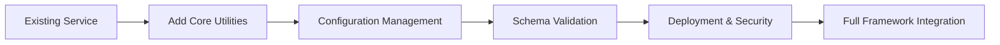

# Clodo Framework - Integration Guide for Service Developers

## Overview

The Clodo Framework enables **service autonomy** - each service can discover, validate, and deploy itself independently to Cloudflare Workers + D1. This guide explains how to properly integrate the framework into your services.

### 🎉 Recent Enhancements: Customer Configuration Management

The Clodo Framework has successfully incorporated **enterprise-grade customer configuration management** capabilities:

- **✅ Multi-Customer Support**: Isolated configuration management for multiple customers
- **✅ Template-Based Onboarding**: Automated customer setup from reusable templates
- **✅ Multi-Environment Configs**: Separate configurations for dev/staging/production
- **✅ Framework Integration**: Seamless integration with existing domain and feature flag systems
- **✅ CLI Tools**: Command-line interface for customer management (`clodo-customer-config`)
- **✅ Service Autonomy**: Customer configs can be embedded in individual service repositories
- **✅ TypeScript Support**: Comprehensive type definitions with 500+ lines of TypeScript interfaces

**Migration Path**: Use framework tools during development, then copy generated configurations to your service repositories for production deployment.

### 🚀 Recent Enhancements: Deployment & Security Validation

The Clodo Framework has been enhanced with **enterprise-grade deployment validation and security features**:

- **✅ Real HTTP Health Checks**: Native Node.js HTTP/HTTPS modules replace shell commands for cross-platform reliability
- **✅ Interactive Deployment Configuration**: User input-driven setup for deployment workflows with validation
- **✅ Comprehensive Error Reporting**: Actionable error messages with troubleshooting suggestions
- **✅ Enhanced Security Validation**: Real deployment validation with URL extraction and post-deployment checks
- **✅ Cross-Platform Compatibility**: Eliminated platform-specific shell command dependencies

**Key Benefits**:
- **Reliable Health Monitoring**: HTTP-based health checks work consistently across Windows, Linux, and macOS
- **User-Friendly Deployment**: Interactive wizards guide users through configuration setup
- **Better Error Handling**: Clear, actionable error messages help resolve deployment issues quickly
- **Enhanced Security**: Real validation ensures deployments meet security requirements

**Integration Example**:
```javascript
import { deployWithSecurity, InteractiveDeploymentConfigurator } from '@tamyla/clodo-framework/security';

// Interactive configuration setup
const config = await InteractiveDeploymentConfigurator.runConfigurationWizard();

// Secure deployment with real validation
await deployWithSecurity({
  customer: config.customer,
  environment: config.environment,
  deploymentUrl: config.domain,
  dryRun: config.dryRun
});
```

## Architecture Overview

### Two Runtime Environments

**🚀 Deployment Time (Your Machine):**
- Node.js environment during development/build
- Uses: File system, child processes, network calls
- Components: Orchestration, validation, deployment scripts
- Purpose: Build and deploy your service

**☁️ Runtime (Cloudflare Workers):**
- V8 isolate environment
- Limitations: No file system, no child processes
- Components: Data services, routing, schema validation
- Purpose: Handle requests in production

### Service Autonomy Philosophy

> **Each service discovers and deploys itself independently**

Your service should **embed deployment capabilities**, not call external CLI tools.

## Integration Patterns

### ❌ WRONG: Calling Bin Scripts Externally
```bash
# DON'T DO THIS - Bin scripts have import issues when called from node_modules
npm install @tamyla/clodo-framework
# Then in package.json:
"scripts": {
  "deploy": "node node_modules/@tamyla/clodo-framework/bin/enterprise-deploy.js deploy --interactive"
}
```

### ✅ CORRECT: Embed Deployment Logic

**1. Add Framework as Dependency:**
```json
// package.json
{
  "name": "my-data-service",
  "dependencies": {
    "@tamyla/clodo-framework": "^1.3.2"
  },
  "scripts": {
    "deploy": "node scripts/deploy.js",
    "dev": "node scripts/dev.js"
  }
}
```

**2. Create Service Structure:**
```
my-data-service/
├── src/
│   ├── config/
│   │   ├── domains.js     # Domain configuration
│   │   └── schema.js      # Data models
│   └── worker/
│       └── index.js       # Cloudflare Worker entry
├── scripts/
│   ├── deploy.js          # Deployment script
│   └── dev.js            # Development server
├── wrangler.toml         # Cloudflare config
└── package.json
```

**3. Domain Configuration:**
```javascript
// src/config/domains.js
export const domains = {
  'my-service.com': {
    name: 'my-service',
    displayName: 'My Data Service',
    accountId: process.env.CLOUDFLARE_ACCOUNT_ID,
    zoneId: process.env.CLOUDFLARE_ZONE_ID,
    domains: {
      production: 'api.my-service.com',
      staging: 'staging-api.my-service.com'
    },
    features: {
      dataService: true,
      logging: true,
      cors: true
    }
  }
};
```

**4. Schema Definition:**
```javascript
// src/config/schema.js
import { schemaManager } from '@tamyla/clodo-framework/schema';

schemaManager.registerModel('users', {
  columns: {
    id: { type: 'string', primary: true },
    email: { type: 'string', required: true, unique: true },
    name: { type: 'string', required: true },
    created_at: { type: 'datetime', default: 'now' },
    updated_at: { type: 'datetime', default: 'now' }
  }
});

schemaManager.registerModel('posts', {
  columns: {
    id: { type: 'string', primary: true },
    user_id: { type: 'string', required: true, references: 'users.id' },
    title: { type: 'string', required: true },
    content: { type: 'text' },
    created_at: { type: 'datetime', default: 'now' }
  }
});
```

**5. Customer Configuration Management (Optional):**

For services that need multi-customer support, you can integrate the Clodo Framework's customer configuration system:

```javascript
// src/config/customers.js (Optional - for multi-customer services)
import { CustomerConfigurationManager } from '@tamyla/clodo-framework/config';

// Initialize customer manager for service environment
const customerManager = new CustomerConfigurationManager();

// Load existing customer configurations
await customerManager.loadExistingCustomers();

// Get current customer from environment
const currentCustomer = process.env.CUSTOMER_NAME || 'default';

// Get customer-specific configuration
const customerConfig = customerManager.showConfig(currentCustomer, process.env.NODE_ENV || 'development');

// Use customer configuration
const dbUrl = customerConfig.variables.customer.DATABASE_URL;
const jwtSecret = customerConfig.variables.customer.JWT_SECRET;
```

**Note**: Customer configurations are typically managed at the service level, not embedded in the framework. Use the framework's customer management tools during development, then copy the generated configurations to your service repositories.

**6. Cloudflare Worker (Runtime):**
```javascript
// src/worker/index.js
import { initializeService, COMMON_FEATURES } from '@tamyla/clodo-framework';
import { GenericDataService } from '@tamyla/clodo-framework/services';
import { EnhancedRouter } from '@tamyla/clodo-framework/routing';
import { domains } from '../config/domains.js';
import '../config/schema.js'; // Register schemas

export default {
  async fetch(request, env, ctx) {
    try {
      // Initialize service context
      const service = initializeService(env, domains);

      // Create data services
      const userService = new GenericDataService(env.DB, 'users');
      const postService = new GenericDataService(env.DB, 'posts');

      // Create router
      const router = new EnhancedRouter();

      // Health check
      router.get('/health', async () => {
        return new Response(JSON.stringify({
          status: 'healthy',
          service: service.domain,
          environment: service.environment,
          features: service.features,
          timestamp: new Date().toISOString()
        }), {
          headers: { 'Content-Type': 'application/json' }
        });
      });

      // API routes
      router.get('/api/users', async () => {
        const users = await userService.findAll();
        return new Response(JSON.stringify(users), {
          headers: { 'Content-Type': 'application/json' }
        });
      });

      router.post('/api/users', async (request) => {
        const data = await request.json();
        const user = await userService.create(data);
        return new Response(JSON.stringify(user), {
          status: 201,
          headers: { 'Content-Type': 'application/json' }
        });
      });

      router.get('/api/users/:id', async (request, params) => {
        const user = await userService.findById(params.id);
        if (!user) {
          return new Response(JSON.stringify({ error: 'User not found' }), {
            status: 404,
            headers: { 'Content-Type': 'application/json' }
          });
        }
        return new Response(JSON.stringify(user), {
          headers: { 'Content-Type': 'application/json' }
        });
      });

      // Handle request
      return await router.handle(request, env, ctx);

    } catch (error) {
      console.error('Worker error:', error);

      // Log errors if logging is enabled
      if (service?.features?.includes(COMMON_FEATURES.LOGGING)) {
        console.error('Request failed:', request.url, error.message);
      }

      return new Response(JSON.stringify({
        error: 'Internal server error',
        message: error.message
      }), {
        status: 500,
        headers: { 'Content-Type': 'application/json' }
      });
    }
  }
};
```

**6. Deployment Script (Build Time):**
```javascript
// scripts/deploy.js
import { MultiDomainOrchestrator, DeploymentValidator, WranglerDeployer } from '@tamyla/clodo-framework/orchestration';
import { DomainDiscovery } from '@tamyla/clodo-framework/config/discovery';
import { askChoice, askUser } from '@tamyla/clodo-framework/utils/interactive';
import { domains } from '../src/config/domains.js';

async function deploy() {
  try {
    console.log('🚀 Clodo Framework Deployment');
    console.log('==========================');

    // Select environment
    const environment = await askChoice(
      'Select deployment environment:',
      ['development', 'staging', 'production'],
      2 // Default to production
    );

    // Select domain
    const domainNames = Object.keys(domains);
    const selectedDomain = await askChoice(
      'Select domain to deploy:',
      domainNames,
      0
    );
    const domain = domainNames[selectedDomain];

    console.log(`\n🌍 Deploying ${domain} to ${environment}`);
    console.log('=====================================');

    // Initialize deployment components
    const discovery = new DomainDiscovery({
      enableCaching: true
    });

    const validator = new DeploymentValidator({
      validationLevel: 'comprehensive',
      environment
    });

    const orchestrator = new MultiDomainOrchestrator({
      domains: [domain],
      environment,
      dryRun: false,
      parallelDeployments: 1
    });

    // Validate domain
    console.log('🔍 Validating domain configuration...');
    await discovery.initializeDiscovery();
    const domainConfig = await discovery.getDomainConfig(domain);

    if (!domainConfig) {
      throw new Error(`Domain ${domain} not found in configuration`);
    }

    // Validate deployment readiness
    console.log('✅ Running pre-deployment validation...');
    const validation = await validator.validateDeploymentReadiness(domain, {
      environment,
      skipEndpointCheck: environment === 'development'
    });

    if (!validation.valid) {
      console.error('❌ Validation failed:');
      validation.errors.forEach(error => console.error(`   - ${error}`));
      process.exit(1);
    }

    // Deploy
    console.log('🚀 Starting deployment...');
    await orchestrator.initialize();
    const result = await orchestrator.deploySingleDomain(domain);

    console.log('✅ Deployment successful!');
    console.log(`🌐 Service URL: ${result.url}`);
    console.log(`⏱️  Duration: ${result.duration}ms`);

  } catch (error) {
    console.error('❌ Deployment failed:', error.message);
    process.exit(1);
  }
}

deploy();
```

**7. Development Script:**
```javascript
// scripts/dev.js
import { spawn } from 'child_process';
import { fileURLToPath } from 'url';
import { dirname, join } from 'path';

const __filename = fileURLToPath(import.meta.url);
const __dirname = dirname(__filename);

console.log('🚀 Starting Clodo Framework Development Server');
console.log('===========================================');

// Start Wrangler dev server
const wrangler = spawn('npx', ['wrangler', 'dev'], {
  cwd: join(__dirname, '..'),
  stdio: 'inherit',
  shell: true
});

wrangler.on('close', (code) => {
  console.log(`\nWrangler exited with code ${code}`);
});

wrangler.on('error', (error) => {
  console.error('Failed to start Wrangler:', error);
  process.exit(1);
});
```

## Configuration Files

### wrangler.toml
```toml
name = "my-data-service"
main = "src/worker/index.js"
compatibility_date = "2024-01-01"

[vars]
ENVIRONMENT = "production"

[[d1_databases]]
binding = "DB"
database_name = "my-data-service-db"
database_id = "your-database-id"

[build]
command = "npm run build"
```

### Environment Variables
```bash
# Required for deployment
export CLOUDFLARE_ACCOUNT_ID="your_account_id"
export CLOUDFLARE_ZONE_ID="your_zone_id"
export CLOUDFLARE_API_TOKEN="your_api_token"

# Optional
export ENVIRONMENT="production"
```

## Usage Commands

### Development
```bash
# Start development server
npm run dev

# Test endpoints
curl http://localhost:8787/health
curl http://localhost:8787/api/users
```

### Deployment
```bash
# Deploy to production
npm run deploy

# Deploy to staging
ENVIRONMENT=staging npm run deploy
```

### Validation
```bash
# Validate configuration
node -e "
import { DeploymentValidator } from '@tamyla/clodo-framework/orchestration';
const validator = new DeploymentValidator();
validator.validateDeploymentReadiness('my-service.com').then(console.log);
"
```

### Customer Configuration Management

For services that support multiple customers, integrate customer-specific configuration:

```bash
# During development, use framework tools to generate customer configs
npx clodo-customer-config create-customer mycompany mycompany.com

# Copy generated configs to your service
cp config/customers/mycompany/* src/config/customers/mycompany/

# In production, load customer-specific configuration
node -e "
import { CustomerConfigurationManager } from '@tamyla/clodo-framework/config';
const manager = new CustomerConfigurationManager();
await manager.loadExistingCustomers();
const config = manager.showConfig(process.env.CUSTOMER_NAME, process.env.NODE_ENV);
console.log('Customer config loaded:', config.customer);
"
```

## 🔧 Modular CLI Capabilities

The CLODO Framework provides **modular CLI capabilities** that can be imported and used programmatically in your services, enabling seamless integration of CLI functionality into your deployment and management workflows.

### Service Management Modules

**Programmatic Service Creation:**
```javascript
import { ServiceCreator } from '@tamyla/clodo-framework/service-management';

const creator = new ServiceCreator();

// Create a new service from template
await creator.createService({
  name: 'my-new-service',
  template: 'data-service',
  domain: 'api.mycompany.com',
  features: ['authentication', 'logging']
});
```

**Programmatic Service Initialization:**
```javascript
import { ServiceInitializer } from '@tamyla/clodo-framework/service-management';

const initializer = new ServiceInitializer();

// Initialize service with configuration
await initializer.initializeService({
  serviceName: 'my-service',
  environment: 'production',
  customer: 'mycompany',
  configOverrides: {
    databaseUrl: 'https://prod-db.mycompany.com'
  }
});
```

### Security CLI Module

**Programmatic Security Operations:**
```javascript
import { SecurityCLI } from '@tamyla/clodo-framework/security';

const security = new SecurityCLI();

// Validate security configuration
const issues = await security.validateConfig('mycompany', 'production');
if (issues.length > 0) {
  console.error('Security issues found:', issues);
}

// Generate secure keys
const apiKey = await security.generateApiKey();
const jwtSecret = await security.generateJwtSecret();

// Deploy with security validation
await security.deployWithValidation({
  customer: 'mycompany',
  environment: 'production',
  domain: 'api.mycompany.com'
});
```

### Customer Configuration CLI Module

**Programmatic Customer Management:**
```javascript
import { CustomerConfigCLI } from '@tamyla/clodo-framework/config';

const customerConfig = new CustomerConfigCLI();

// Create new customer configuration
await customerConfig.createCustomer({
  name: 'newcustomer',
  domain: 'api.newcustomer.com',
  environment: 'production'
});

// Show customer configuration
const config = await customerConfig.showConfig('newcustomer', 'production');
console.log('Customer config:', config);

// Update customer settings
await customerConfig.updateCustomer('newcustomer', {
  features: { analytics: true, notifications: false }
});
```

### Integration in Deployment Scripts

**Combine modular CLI capabilities in your deployment pipeline:**
```javascript
// scripts/deploy-and-configure.js
import { ServiceCreator, ServiceInitializer } from '@tamyla/clodo-framework/service-management';
import { SecurityCLI } from '@tamyla/clodo-framework/security';
import { CustomerConfigCLI } from '@tamyla/clodo-framework/config';

async function deployAndConfigure() {
  const creator = new ServiceCreator();
  const initializer = new ServiceInitializer();
  const security = new SecurityCLI();
  const customerConfig = new CustomerConfigCLI();

  try {
    // Create service if it doesn't exist
    await creator.createService({
      name: process.env.SERVICE_NAME,
      domain: process.env.DOMAIN
    });

    // Configure customer settings
    await customerConfig.createCustomer({
      name: process.env.CUSTOMER_NAME,
      domain: process.env.DOMAIN
    });

    // Initialize with secure configuration
    await initializer.initializeService({
      serviceName: process.env.SERVICE_NAME,
      environment: process.env.NODE_ENV,
      customer: process.env.CUSTOMER_NAME
    });

    // Deploy with security validation
    await security.deployWithValidation({
      customer: process.env.CUSTOMER_NAME,
      environment: process.env.NODE_ENV,
      domain: process.env.DOMAIN
    });

    console.log('✅ Service deployed and configured successfully');

  } catch (error) {
    console.error('❌ Deployment failed:', error.message);
    throw error;
  }
}

deployAndConfigure();
```

### Benefits of Modular CLI Integration

- **🔧 Programmatic Control**: Use CLI functionality directly in your code without shell commands
- **🔄 Pipeline Integration**: Seamlessly integrate framework capabilities into CI/CD workflows  
- **🧪 Testable Operations**: Test CLI operations programmatically in your test suites
- **📦 Bundle Optimization**: Import only the CLI modules you need
- **🔒 Type Safety**: Full TypeScript support for all CLI operations
- **⚡ Performance**: Direct imports avoid shell command overhead

## Common Mistakes to Avoid

### 1. Don't Call Bin Scripts Externally
```javascript
// ❌ WRONG
"scripts": {
  "deploy": "node node_modules/@tamyla/clodo-framework/bin/enterprise-deploy.js deploy --interactive"
}

// ✅ CORRECT
"scripts": {
  "deploy": "node scripts/deploy.js"
}
```

### 2. Don't Use Deployment Components in Workers
```javascript
// ❌ WRONG - Won't work in Cloudflare Workers
import { MultiDomainOrchestrator } from '@tamyla/clodo-framework/orchestration';

export default {
  fetch(request, env) {
    const orchestrator = new MultiDomainOrchestrator(); // Uses fs, child_process
  }
}

// ✅ CORRECT - Use only runtime components
import { GenericDataService } from '@tamyla/clodo-framework/services';
```

### 3. Always Handle Async Operations
```javascript
// ❌ WRONG
router.get('/api/data', () => {
  const data = await dataService.findAll(); // await in non-async function
  return new Response(JSON.stringify(data));
});

// ✅ CORRECT
router.get('/api/data', async () => {
  const data = await dataService.findAll();
  return new Response(JSON.stringify(data));
});
```

### 4. Always Return Response Objects
```javascript
// ❌ WRONG
export default {
  fetch(request, env) {
    return { status: 'ok' }; // Not a Response object
  }
}

// ✅ CORRECT
export default {
  fetch(request, env) {
    return new Response(JSON.stringify({ status: 'ok' }), {
      headers: { 'Content-Type': 'application/json' }
    });
  }
}
```

## Component Reference

### Runtime Components (Worker-Compatible)
- `initializeService()` - Service context initialization
- `GenericDataService` - D1 database operations
- `schemaManager` - Data validation and modeling
- `EnhancedRouter` - HTTP request routing
- `COMMON_FEATURES` - Feature flag constants

### Deployment Components (Build-Time Only)
- `MultiDomainOrchestrator` - Deployment orchestration
- `DeploymentValidator` - Pre-deployment validation
- `DomainDiscovery` - Cloudflare domain discovery
- `WranglerDeployer` - **Intelligent wrangler CLI execution with auto-discovery**
- `ProductionTester` - Post-deployment testing

## Advanced WranglerDeployer Features

The `WranglerDeployer` is designed to be maximally generic and intelligent:

### 🔍 **Automatic Configuration Discovery**
- **Multi-config support**: Automatically detects `wrangler.toml` vs `config/wrangler.toml`
- **Environment detection**: Discovers environment-specific configurations
- **Service information**: Extracts worker names, routes, and settings from config files

### 🌍 **Intelligent Environment Detection**
```javascript
// Automatically detects environment from:
const deployer = new WranglerDeployer();
// - Environment variables (NODE_ENV, ENVIRONMENT)
// - Git branch (main/master → production, develop → development)
// - Cloudflare Pages branch (CF_PAGES_BRANCH)
console.log(deployer.environment); // 'production', 'staging', or 'development'
```

### 🔧 **Real-time Environment Variable Integration**
Automatically includes relevant environment variables in deployments:
```javascript
// Cloudflare variables
CLOUDFLARE_ACCOUNT_ID, CLOUDFLARE_API_TOKEN, CF_API_TOKEN

// Service variables  
SERVICE_DOMAIN, SERVICE_NAME, LOG_LEVEL, CORS_ORIGINS
DATA_SERVICE_URL, AUTH_SERVICE_URL, CONTENT_STORE_SERVICE_URL

// Environment-specific
PRODUCTION_URL, STAGING_DOMAIN, CF_DEVELOPMENT_TOKEN
```

### 📋 **Smart URL Extraction**
Multiple strategies for extracting deployment URLs:
1. **Direct parsing** from wrangler output patterns
2. **Route-based** URLs from wrangler.toml configuration  
3. **Worker name construction** for workers.dev domains
4. **Environment-aware** URL validation

### ✅ **Enhanced Validation**
```javascript
const validation = await deployer.validateWranglerSetup('production');
// Returns detailed config info, account details, and actionable suggestions
```

## Intelligent Deployment Example

```javascript
import { WranglerDeployer } from '@tamyla/clodo-framework/deployment';

async function deploy() {
  // Create deployer - automatically detects environment and service info
  const deployer = new WranglerDeployer({
    cwd: process.cwd(),
    timeout: 300000
  });

  console.log(`🌍 Detected environment: ${deployer.environment}`);
  console.log(`📦 Service: ${deployer.serviceInfo.name} v${deployer.serviceInfo.version}`);

  // Validate setup with intelligent discovery
  const validation = await deployer.validateWranglerSetup(deployer.environment);
  if (!validation.valid) {
    console.error('❌ Setup issues:', validation.error);
    console.log('💡 Suggestions:', validation.suggestions);
    return;
  }

  // Deploy with automatic configuration discovery
  const result = await deployer.deploy(deployer.environment);
  
  console.log(`✅ Deployed to: ${result.url}`);
  console.log(`⏱️ Duration: ${result.duration}ms`);
  console.log(`🔧 Config used: ${result.config.configPath}`);
}
```

## Troubleshooting

### "require is not defined"
- **Cause**: Using deployment components in Worker runtime
- **Fix**: Only use runtime components in `src/worker/index.js`

### "Cannot read properties of undefined (reading 'valid')"
- **Cause**: Validator method not returning expected result
- **Fix**: Ensure proper error handling in deployment scripts

### "Service directory not found"
- **Cause**: Domain configuration mismatch
- **Fix**: Verify `src/config/domains.js` has correct domain entries

### Import Errors
- **Cause**: Wrong import paths or missing dependencies
- **Fix**: Use exact import paths from framework documentation

### "Environment auto-detection failed"
- **Cause**: WranglerDeployer couldn't determine the target environment
- **Fix**: Set explicit environment variables or pass environment to constructor
```bash
export ENVIRONMENT=production
# or
export NODE_ENV=production
```

### "Configuration discovery failed"
- **Cause**: No wrangler.toml found or parsing failed
- **Fix**: Ensure wrangler.toml exists and has correct format
```bash
wrangler init  # Creates basic wrangler.toml
# or create config/wrangler.toml for environment-specific config
```

### "URL extraction failed"
- **Cause**: Wrangler output format changed or no valid URL found
- **Fix**: Check wrangler output manually or ensure routes are defined in wrangler.toml

## 🧪 Production Testing Suite

The `ProductionTester` provides comprehensive post-deployment validation to ensure your Cloudflare Workers are functioning correctly in downstream environments.

### **Core Testing Capabilities**

```javascript
import { ProductionTester } from '@tamyla/clodo-framework/deployment';

const tester = new ProductionTester({
  verbose: true,
  generateReport: true,
  exportMetrics: true,
  timeout: 30000,
  responseTimeThreshold: 2000
});

// Run comprehensive production tests
const results = await tester.runProductionTests('https://your-service.workers.dev', {
  testSuites: ['health', 'authentication', 'endpoints', 'database', 'performance']
});
```

### **Available Test Suites**

#### **Health Checks** 🏥
- **Endpoint Availability**: Verifies service is responding
- **Response Time Validation**: Ensures acceptable performance
- **Status Code Validation**: Confirms proper HTTP responses
- **Basic Connectivity**: Network reachability testing

```javascript
// Quick health check
const healthResult = await tester.runProductionTests(baseUrl, {
  testSuites: ['health']
});
// Returns: { passed: 2, failed: 0, checks: [...] }
```

#### **Authentication Flow Testing** 🔐
- **JWT Token Validation**: Tests authentication endpoints
- **API Key Verification**: Validates key-based authentication
- **Session Management**: Tests login/logout flows
- **Authorization Checks**: Verifies access control

```javascript
// Test authentication flows
const authResult = await tester.runProductionTests(baseUrl, {
  testSuites: ['authentication'],
  testUser: {
    email: 'test@example.com',
    password: 'testpass123'
  }
});
```

#### **API Endpoint Testing** 🌐
- **CRUD Operations**: Tests Create, Read, Update, Delete
- **Error Handling**: Validates proper error responses
- **Data Validation**: Ensures API contracts are met
- **Rate Limiting**: Tests throttling behavior

#### **Database Connectivity** 🗄️
- **D1 Connection**: Validates Cloudflare D1 database access
- **Query Execution**: Tests SQL operations
- **Transaction Handling**: Verifies ACID compliance
- **Connection Pooling**: Tests connection management

#### **Performance Monitoring** ⚡
- **Response Times**: Measures API latency
- **Throughput Testing**: Validates concurrent requests
- **Memory Usage**: Monitors resource consumption
- **Error Rates**: Tracks failure percentages

### **Advanced Testing Features**

#### **Custom Test Configuration**
```javascript
const tester = new ProductionTester({
  retryAttempts: 3,
  retryDelay: 1000,
  timeout: 30000,
  concurrent: true,  // Run tests in parallel
  responseTimeThreshold: 2000,  // Max acceptable response time
  healthCheckThreshold: 500,    // Health check timeout
  authFlowThreshold: 5000       // Auth flow timeout
});
```

#### **Environment-Specific Testing**
```javascript
// Test different environments
const prodResults = await tester.runProductionTests('https://api.company.com', {
  environment: 'production'
});

const stagingResults = await tester.runProductionTests('https://staging-api.company.com', {
  environment: 'staging'
});
```

#### **Regression Testing**
```javascript
// Compare against baseline metrics
const results = await tester.runProductionTests(baseUrl, {
  testSuites: ['regression'],
  baselineMetrics: './test-baselines/production.json'
});
```

### **Test Result Analysis**

#### **Structured Results**
```javascript
{
  environment: 'production',
  timestamp: '2025-10-08T10:30:00.000Z',
  tests: {
    health: { passed: 3, failed: 0, checks: [...] },
    authentication: { passed: 5, failed: 1, checks: [...] },
    database: { passed: 4, failed: 0, checks: [...] }
  },
  summary: {
    passed: 12,
    failed: 1,
    total: 13,
    successRate: 92.3
  }
}
```

#### **Report Generation**
```javascript
const tester = new ProductionTester({
  generateReport: true,
  exportMetrics: true,
  reportPath: './test-reports',
  metricsPath: './test-metrics'
});

// Generates:
// - test-reports/production-2025-10-08.json
// - test-metrics/performance-trends.csv
```

### **Integration with Deployment Pipeline**

```javascript
// Post-deployment validation
const deployAndTest = async (serviceConfig) => {
  // Deploy the service
  const deployment = await deployer.deploy(serviceConfig);
  
  // Run production tests
  const testResults = await tester.runProductionTests(deployment.url, {
    testSuites: ['health', 'authentication', 'endpoints']
  });
  
  // Validate results
  if (testResults.summary.failed > 0) {
    console.error('❌ Deployment validation failed');
    // Trigger rollback or alert
    await rollbackManager.rollback(deployment.id);
    return { success: false, issues: testResults };
  }
  
  return { success: true, deployment, tests: testResults };
};
```

### **Third-Party Environment Testing**

The ProductionTester works seamlessly in any Cloudflare account:

```javascript
// Test service in customer environment
const customerTest = await tester.runProductionTests(
  'https://customer-service.workers.dev',
  {
    testSuites: ['health', 'database'],
    // Uses customer's API keys/tokens from environment
    apiToken: process.env.CUSTOMER_CLOUDFLARE_TOKEN
  }
);
```

## � Individual Testing Modules

For more granular control, you can import and use individual testing modules instead of the monolithic ProductionTester:

### **API Testing Only**
```javascript
import { ApiTester } from '@tamyla/clodo-framework/deployment/testers';

const apiTester = new ApiTester({
  timeout: 5000,
  responseTimeThreshold: 1000
});

const results = await apiTester.runApiTests('production');
// Tests only API endpoints, not auth or database
```

### **Authentication Testing Only**
```javascript
import { AuthTester } from '@tamyla/clodo-framework/deployment/testers';

const authTester = new AuthTester({
  timeout: 10000
});

const results = await authTester.runAuthTests('https://api.company.com', {
  testUser: { email: 'test@example.com', password: 'test123' }
});
// Tests only authentication flows
```

### **Database Testing Only**
```javascript
import { DatabaseTester } from '@tamyla/clodo-framework/deployment/testers';

const dbTester = new DatabaseTester({
  timeout: 30000
});

const results = await dbTester.runDatabaseTests('production');
// Tests only D1 database connectivity and queries
```

### **Performance Testing Only**
```javascript
import { PerformanceTester } from '@tamyla/clodo-framework/deployment/testers';

const perfTester = new PerformanceTester({
  responseTimeThreshold: 500,
  concurrentRequests: 10
});

const results = await perfTester.runPerformanceTests('https://api.company.com');
// Tests only performance metrics and response times
```

### **Load Testing Only**
```javascript
import { LoadTester } from '@tamyla/clodo-framework/deployment/testers';

const loadTester = new LoadTester({
  maxConcurrentUsers: 100,
  testDuration: 60000, // 1 minute
  rampUpTime: 10000    // 10 seconds
});

const results = await loadTester.runLoadTests('https://api.company.com');
// Tests only load handling and scalability
```

### **Custom Testing Combinations**
```javascript
import { ApiTester, AuthTester, DatabaseTester } from '@tamyla/clodo-framework/deployment/testers';

// Run only the tests you need
const apiResults = await new ApiTester().runApiTests('production');
const authResults = await new AuthTester().runAuthTests(baseUrl, testUser);
const dbResults = await new DatabaseTester().runDatabaseTests('production');

// Combine results as needed
const combinedResults = {
  api: apiResults,
  auth: authResults,
  database: dbResults,
  summary: {
    passed: apiResults.passed + authResults.passed + dbResults.passed,
    failed: apiResults.failed + authResults.failed + dbResults.failed
  }
};
```

## �🔍 Deployment Validator

The `DeploymentValidator` provides enterprise-grade pre-deployment validation to ensure your services are ready for production deployment and can operate correctly in downstream environments.

### **Comprehensive Validation Pipeline**

```javascript
import { DeploymentValidator } from '@tamyla/clodo-framework/deployment';

const validator = new DeploymentValidator({
  validationLevel: 'comprehensive',
  strictMode: true,
  timeout: 30000,
  retryAttempts: 3
});

// Validate deployment readiness
const result = await validator.validateDeployment(['your-service.com'], {
  environment: 'production'
});

if (!result.valid) {
  console.error('❌ Validation failed:', result.errors);
  // Involves developer to fix issues
}
```

### **Validation Categories**

#### **Prerequisites Validation** 📋
- **Node.js Version**: Ensures compatible Node.js version (16+)
- **Required Commands**: Validates wrangler, npm, node availability
- **File System**: Checks for required files (package.json, wrangler.toml)
- **Permissions**: Verifies file/directory access permissions

#### **Authentication Validation** 🔐
- **Cloudflare Tokens**: Validates API token presence and format
- **Account Access**: Verifies account permissions and access
- **Token Expiration**: Checks for expired credentials
- **Multi-Account Support**: Handles different accounts per environment

#### **Network Validation** 🌐
- **Cloudflare API**: Tests connectivity to Cloudflare services
- **DNS Resolution**: Validates domain name resolution
- **SSL/TLS**: Checks certificate validity and configuration
- **Firewall Rules**: Verifies network access rules

#### **Configuration Validation** ⚙️
- **Environment Variables**: Validates required env vars
- **Wrangler Config**: Checks wrangler.toml syntax and settings
- **Domain Configuration**: Verifies domain-to-service mapping
- **Feature Flags**: Validates feature flag configurations

#### **Endpoint Validation** 🎯
- **Service URLs**: Tests endpoint accessibility
- **HTTP Methods**: Validates supported operations
- **Response Formats**: Checks API response structure
- **CORS Settings**: Verifies cross-origin configurations

#### **Deployment Readiness** 🚀
- **Build Process**: Validates build pipeline success
- **Disk Space**: Checks available storage for deployment
- **Memory Usage**: Monitors resource consumption
- **Dependency Checks**: Verifies all dependencies are available

### **Interactive Developer Involvement**

When validation issues are detected, the framework **actively involves developers** to resolve problems:

```javascript
// Automatic issue detection and resolution guidance
const result = await validator.validateDeploymentReadiness();

if (!result.valid) {
  // Framework provides specific guidance
  for (const issue of result.issues) {
    console.log(`❌ ${issue.category}: ${issue.message}`);
    console.log(`💡 Fix: ${issue.suggestion}`);
    
    // For critical issues, prompt for immediate resolution
    if (issue.severity === 'critical') {
      const fix = await promptUser(`How would you like to fix: ${issue.message}?`);
      await applyFix(issue, fix);
    }
  }
}
```

#### **Common Validation Issues & Fixes**

##### **Authentication Issues**
```javascript
// Issue: "Cloudflare authentication required"
const authChoice = await askChoice(
  'Cloudflare authentication needed. What would you like to do?',
  [
    'Login to Cloudflare now',
    'Provide API token manually', 
    'Skip Cloudflare verification (limited features)',
    'Cancel deployment'
  ]
);

// Framework guides through resolution
if (authChoice === 0) {
  await runCommand('wrangler login');
  await validator.revalidateAuthentication();
}
```

##### **Configuration Issues**
```javascript
// Issue: "Missing required environment variables"
// Framework identifies missing vars and suggests fixes
const missing = ['CLOUDFLARE_API_TOKEN', 'DATABASE_URL'];
console.log('Missing environment variables:');
missing.forEach(var => console.log(`  - ${var}`));

// Interactive resolution
for (const var of missing) {
  const value = await askUser(`Enter value for ${var}:`);
  await setEnvironmentVariable(var, value);
}
```

##### **Network Issues**
```javascript
// Issue: "Cannot reach Cloudflare API"
// Framework tests connectivity and provides diagnostics
const networkTest = await validator.testNetworkConnectivity();
if (!networkTest.cloudflare) {
  console.log('❌ Cannot reach Cloudflare API');
  console.log('💡 Check your internet connection and firewall settings');
  console.log('💡 Verify API token permissions');
}
```

### **Third-Party Environment Validation**

The DeploymentValidator works across different Cloudflare accounts and environments:

```javascript
// Validate deployment in customer environment
const customerValidation = await validator.validateDeployment(
  ['customer-service.com'], 
  {
    environment: 'production',
    accountId: 'customer-account-id',
    apiToken: process.env.CUSTOMER_CLOUDFLARE_TOKEN
  }
);

// Cross-account validation
const multiAccountResult = await validator.validateMultiAccountDeployment([
  { domain: 'service1.company.com', accountId: 'account1' },
  { domain: 'service2.company.com', accountId: 'account2' }
]);
```

### **Integration with CI/CD Pipelines**

```javascript
// Pre-deployment validation in CI/CD
const validateBeforeDeploy = async () => {
  console.log('🚀 Starting pre-deployment validation...');
  
  const validator = new DeploymentValidator({
    validationLevel: 'comprehensive',
    strictMode: true
  });
  
  try {
    const result = await validator.validateDeploymentReadiness();
    
    if (!result.valid) {
      console.error('❌ Validation failed - blocking deployment');
      result.issues.forEach(issue => {
        console.error(`  ${issue.severity.toUpperCase()}: ${issue.message}`);
      });
      process.exit(1);
    }
    
    console.log('✅ All validations passed - proceeding with deployment');
    return true;
    
  } catch (error) {
    console.error('💥 Validation error:', error.message);
    process.exit(1);
  }
};
```

### **Advanced Validation Features**

#### **Custom Validation Rules**
```javascript
class CustomValidator extends DeploymentValidator {
  async validateCustomRules() {
    // Add organization-specific validation
    const customChecks = [
      this.validateSecurityCompliance(),
      this.validatePerformanceRequirements(),
      this.validateBusinessRules()
    ];
    
    return await Promise.all(customChecks);
  }
}
```

#### **Validation Result Analysis**
```javascript
{
  overall: 'passed|failed',
  categories: {
    prerequisites: 'passed',
    authentication: 'passed', 
    network: 'failed',
    configuration: 'passed',
    endpoints: 'passed',
    deployment: 'passed'
  },
  details: [
    {
      category: 'network',
      severity: 'error',
      message: 'Cannot reach Cloudflare API',
      suggestion: 'Check internet connection and API token'
    }
  ],
  startTime: '2025-10-08T10:00:00.000Z',
  endTime: '2025-10-08T10:02:30.000Z'
}
```

#### **Validation Reporting**
```javascript
const validator = new DeploymentValidator({
  generateReport: true,
  reportPath: './validation-reports'
});

// Generates detailed validation reports
const result = await validator.validateDeployment(domains, options);
// Creates: validation-reports/deployment-2025-10-08.json
```

## ☁️ Cloudflare Account Management

The `CloudflareDomainManager` enables seamless operation across multiple Cloudflare accounts and environments, making it perfect for third-party downstream deployments and multi-tenant architectures.

### **Multi-Account Operations**

```javascript
import { CloudflareDomainManager } from '@tamyla/clodo-framework/deployment';

const manager = new CloudflareDomainManager({
  apiToken: process.env.CLOUDFLARE_API_TOKEN,
  accountId: process.env.CLOUDFLARE_ACCOUNT_ID
});

// Verify authentication across accounts
await manager.verifyAuthentication();

// Discover available domains in any account
const domains = await manager.discoverDomains();

// Validate deployment permissions
const canDeploy = await manager.validateDeploymentPermissions('customer-service.com');
```

### **Authentication Handling**

#### **Interactive Authentication Resolution**
```javascript
// When authentication issues occur, framework involves developer
async handleAuthenticationRequired() {
  console.log('   ❌ Cloudflare authentication required');
  
  const authChoice = await askChoice(
    'Cloudflare authentication needed. What would you like to do?',
    [
      'Login to Cloudflare now',
      'Provide API token manually', 
      'Skip Cloudflare verification (limited features)',
      'Cancel deployment'
    ]
  );
  
  switch (authChoice) {
    case 0:
      // Guide developer through wrangler login
      await runCommand('wrangler login');
      await this.verifyAuthentication();
      break;
    case 1:
      // Prompt for manual token entry
      const token = await askUser('Enter Cloudflare API token:');
      await this.setApiToken(token);
      break;
    case 2:
      // Limited functionality mode
      console.log('⚠️ Skipping Cloudflare features - limited functionality');
      break;
    default:
      throw new Error('Authentication cancelled by user');
  }
}
```

#### **Token Management**
```javascript
// Secure token storage and validation
const tokenManager = new CloudflareTokenManager();

// Store tokens securely
await tokenManager.storeToken('production', apiToken);

// Validate token permissions
const permissions = await tokenManager.validatePermissions(apiToken);

// Check token expiration
const isValid = await tokenManager.isTokenValid(apiToken);
```

### **Domain Discovery & Management**

#### **Automatic Domain Discovery**
```javascript
// Discover all domains in an account
const discovery = await manager.discoverDomains();

// Returns structured domain information
{
  accountId: 'account-123',
  domains: [
    {
      name: 'api.company.com',
      zoneId: 'zone-456',
      status: 'active',
      sslStatus: 'active',
      nameservers: ['ns1.cloudflare.com', 'ns2.cloudflare.com']
    }
  ],
  workers: [
    {
      name: 'data-service',
      routes: ['api.company.com/api/*'],
      environment: 'production'
    }
  ]
}
```

#### **Service Matching & Discovery**
```javascript
// Find existing services by domain
const existingServices = await manager.findServicesByDomain('api.company.com');

// Intelligent service discovery
const serviceMatch = await manager.matchServiceToDomain({
  domain: 'new-service.company.com',
  serviceName: 'data-service'
});
```

### **Third-Party Account Operations**

#### **Cross-Account Deployment**
```javascript
// Deploy to customer account
const customerManager = new CloudflareDomainManager({
  apiToken: process.env.CUSTOMER_CLOUDFLARE_TOKEN,
  accountId: process.env.CUSTOMER_ACCOUNT_ID
});

// Validate customer environment
await customerManager.verifyAuthentication();
await customerManager.validateDeploymentPermissions('customer-service.com');

// Deploy service to customer account
const deployment = await customerManager.deployService({
  serviceName: 'data-service',
  domain: 'customer-service.com',
  environment: 'production'
});
```

#### **Multi-Tenant Deployments**
```javascript
// Deploy across multiple customer accounts
const multiTenantDeployment = async (customers) => {
  const results = [];
  
  for (const customer of customers) {
    const manager = new CloudflareDomainManager({
      apiToken: customer.apiToken,
      accountId: customer.accountId
    });
    
    try {
      // Verify customer account access
      await manager.verifyAuthentication();
      
      // Deploy service to customer environment
      const result = await manager.deployService({
        serviceName: 'shared-service',
        domain: customer.domain,
        environment: 'production'
      });
      
      results.push({ customer: customer.name, success: true, result });
      
    } catch (error) {
      results.push({ 
        customer: customer.name, 
        success: false, 
        error: error.message 
      });
    }
  }
  
  return results;
};
```

### **Permission & Access Control**

#### **Deployment Permission Validation**
```javascript
// Comprehensive permission checking
const permissions = await manager.validateDeploymentPermissions('service.domain.com');

// Checks for:
// - Account ownership of domain
// - Worker deployment permissions
// - Zone/DNS management access
// - SSL certificate permissions
// - API token scope validation

if (!permissions.canDeploy) {
  console.error('❌ Insufficient permissions for deployment');
  permissions.missing.forEach(perm => {
    console.log(`  Missing: ${perm}`);
  });
}
```

#### **Environment-Specific Permissions**
```javascript
// Validate permissions per environment
const envPermissions = await manager.validateEnvironmentPermissions({
  domain: 'service.domain.com',
  environment: 'production'
});

// Production environment requires stricter permissions
if (envPermissions.production) {
  console.log('✅ Production deployment authorized');
} else {
  console.log('❌ Production deployment not authorized');
  console.log('Required permissions:', envPermissions.required);
}
```

### **Integration with Orchestration**

#### **Multi-Domain Coordination**
```javascript
import { MultiDomainOrchestrator } from '@tamyla/clodo-framework/deployment';

const orchestrator = new MultiDomainOrchestrator({
  maxConcurrentDeployments: 3,
  crossDomainCoordination: true
});

// Coordinate deployments across accounts
await orchestrator.deployMultipleDomains([
  {
    domain: 'service1.company.com',
    accountId: 'account-1',
    apiToken: 'token-1'
  },
  {
    domain: 'service2.customer.com', 
    accountId: 'account-2',
    apiToken: 'token-2'
  }
]);
```

#### **Account-Aware Rollback**
```javascript
// Rollback with account context
const rollbackManager = new RollbackManager();

await rollbackManager.rollbackDeployment(deploymentId, {
  accountId: targetAccountId,
  apiToken: accountToken,
  preserveCustomerData: true  // Don't affect customer data
});
```

### **Security & Compliance**

#### **Account Isolation**
```javascript
// Ensure proper account isolation
const isolationCheck = await manager.validateAccountIsolation({
  sourceAccount: 'your-account',
  targetAccount: 'customer-account'
});

if (!isolationCheck.isolated) {
  throw new Error('Account isolation violation detected');
}
```

#### **Audit Logging**
```javascript
// Comprehensive audit trails
const auditor = new DeploymentAuditor({
  auditLevel: 'detailed'
});

await auditor.logAccountOperation({
  operation: 'deploy',
  accountId: targetAccountId,
  domain: deployedDomain,
  timestamp: new Date(),
  operator: process.env.USER,
  permissions: validatedPermissions
});
```

## 🏗️ Adopting CLODO Framework in Existing Projects

Most developers have existing codebases and want to **gradually integrate** the CLODO Framework rather than starting from scratch. This section covers **incremental adoption strategies** for brownfield projects.

### 🎯 Understanding Incremental Adoption

The CLODO Framework is designed for **modular adoption** - you can start with individual components and progressively adopt more features:



### 📦 Phase 1: Core Utilities (Lowest Risk)

**Start with error handling, logging, and basic utilities:**

```javascript
// Your existing service
import express from 'express';
const app = express();

// Add CLODO error handling (no breaking changes)
import { ErrorHandler } from '@tamyla/clodo-framework';

app.use((err, req, res, next) => {
  ErrorHandler.handleDeploymentError(err, {
    customer: 'my-company',
    environment: process.env.NODE_ENV,
    phase: 'api'
  });
  // Your existing error handling continues...
});
```

**Benefits:**
- ✅ Zero breaking changes to existing code
- ✅ Immediate improvement in error reporting
- ✅ Easy rollback if needed

### 🔧 Phase 2: Data Service Integration

**Wrap existing database operations with CLODO components:**

```javascript
// Before: Direct database calls
class MyDataService {
  async getUsers() {
    return db.query('SELECT * FROM users');
  }
}

// After: CLODO-wrapped with validation
import { GenericDataService, SchemaManager } from '@tamyla/clodo-framework';

class EnhancedDataService extends GenericDataService {
  constructor(existingDb) {
    super({ d1Database: existingDb });
    this.existing = existingDb;
  }

  async getUsers(query = {}) {
    // CLODO validation + your existing logic
    const validatedQuery = this.validateQuery(query);
    return this.existing.query('SELECT * FROM users WHERE ?', validatedQuery);
  }
}
```

### ⚙️ Phase 3: Configuration Management

**Replace hardcoded configurations with CLODO's system:**

```javascript
// Before: Hardcoded configuration
const config = {
  apiVersion: 'v1',
  corsOrigins: ['https://myapp.com'],
  databaseUrl: process.env.DATABASE_URL
};

// After: CLODO domain configuration
import { createDomainConfigSchema } from '@tamyla/clodo-framework';

export const domains = {
  'my-existing-api': {
    ...createDomainConfigSchema(),
    name: 'my-existing-api',
    displayName: 'My Existing API Service',
    accountId: process.env.CLOUDFLARE_ACCOUNT_ID,
    apiVersion: process.env.API_VERSION || 'v1',
    corsOrigins: process.env.CORS_ORIGINS?.split(',') || ['https://myapp.com'],
    features: {
      logging: true,
      cors: true,
      authentication: true
    }
  }
};
```

### 🚀 Phase 4: Deployment Integration

**Add CLODO deployment capabilities to your existing CI/CD:**

```javascript
// scripts/deploy.js
import { deployWithSecurity } from '@tamyla/clodo-framework/security';
import { domains } from '../src/config/domains.js';

async function deploy() {
  const domain = domains['my-existing-api'];

  await deployWithSecurity({
    customer: 'my-company',
    environment: process.env.NODE_ENV || 'staging',
    deploymentUrl: domain.domains.production,
    dryRun: process.argv.includes('--dry-run')
  });
}

deploy().catch(console.error);
```

### 🎨 Customizing Generated Services

Services created with `clodo-create-service` are **starting templates**, not final products. Here's how to customize them:

#### **1. Replace Generic Logic with Your Business Logic**

```javascript
// Generated: src/worker/index.js (REPLACE THIS)
export default {
  async fetch(request, env) {
    // Generic placeholder code - replace with your logic
    return new Response('Hello from CLODO service');
  }
};

// Customized: Your actual service logic
import { GenericDataService } from '@tamyla/clodo-framework';

export default {
  async fetch(request, env) {
    const dataService = new GenericDataService({ d1Database: env.DB });

    if (request.method === 'GET' && new URL(request.url).pathname === '/users') {
      const users = await dataService.find('users');
      return Response.json(users);
    }

    return new Response('Not found', { status: 404 });
  }
};
```

#### **2. Update Domain Configuration**

```javascript
// src/config/domains.js - Customize for your domains
export const domains = {
  'my-custom-service': {
    ...createDomainConfigSchema(),
    name: 'my-custom-service',
    displayName: 'My Custom API Service',
    accountId: 'your-actual-cloudflare-account-id',
    zoneId: 'your-actual-cloudflare-zone-id',
    domains: {
      production: 'api.mycompany.com',
      staging: 'staging-api.mycompany.com',
      development: 'dev-api.mycompany.com'
    },
    features: {
      authentication: true,
      logging: true,
      cors: true,
      rateLimiting: false  // Your custom features
    }
  }
};
```

#### **3. Add Your Dependencies**

```json
// package.json - Add your specific dependencies
{
  "name": "my-custom-service",
  "dependencies": {
    "@tamyla/clodo-framework": "^3.0.5",
    "stripe": "^12.0.0",           // Your payment processing
    "jsonwebtoken": "^9.0.0",      // Your auth library
    "redis": "^4.6.0"              // Your caching layer
  }
}
```

### 🔄 Migration Patterns

#### **Pattern 1: Wrapper Approach (Safest)**

```javascript
// Keep existing service intact
class MyLegacyService {
  async processData(data) {
    // Your existing business logic
    return this.legacyProcessing(data);
  }
}

// Add CLODO capabilities via composition
import { GenericDataService } from '@tamyla/clodo-framework';

class ClodoEnhancedService {
  constructor(legacyService) {
    this.legacy = legacyService;
    this.dataService = new GenericDataService();
  }

  async processData(data) {
    // CLODO validation
    const validated = this.dataService.validateData(data);

    // Your existing logic
    const result = await this.legacy.processData(validated);

    // CLODO error handling
    return this.dataService.handleResponse(result);
  }
}
```

#### **Pattern 2: Gradual Replacement**

```javascript
// Phase 1: Add logging
import { ErrorHandler } from '@tamyla/clodo-framework';
app.use((err, req, res, next) => {
  ErrorHandler.handleDeploymentError(err, { phase: 'api' });
  // existing error handling
});

// Phase 2: Add validation
import { SchemaManager } from '@tamyla/clodo-framework';
const schema = new SchemaManager();
app.post('/users', (req, res) => {
  const validated = schema.validate('users', req.body);
  // existing logic with validated data
});

// Phase 3: Full migration
// Replace entire routes with CLODO components
```

#### **Pattern 3: Feature Flags for Gradual Rollout**

```javascript
import { isFeatureEnabled } from '@tamyla/clodo-framework';

app.get('/api/users', async (req, res) => {
  if (isFeatureEnabled('clodo-data-service')) {
    // Use CLODO data service
    const dataService = new GenericDataService();
    const users = await dataService.find('users');
    res.json(users);
  } else {
    // Use existing implementation
    const users = await legacyUserService.getAll();
    res.json(users);
  }
});
```

### 🧪 Testing Integration

**Add tests that validate CLODO integration:**

```javascript
// test/integration.test.js
import { GenericDataService, ErrorHandler } from '@tamyla/clodo-framework';

describe('CLODO Framework Integration', () => {
  test('should enhance existing data operations', async () => {
    const service = new GenericDataService({ d1Database: mockDb });

    // Your existing test data
    const result = await service.find('users', { active: true });

    expect(result).toBeDefined();
    // CLODO adds validation, error handling, etc.
  });

  test('should handle errors with CLODO reporting', () => {
    const error = new Error('Database connection failed');

    expect(() => {
      ErrorHandler.handleDeploymentError(error, {
        customer: 'test-customer',
        phase: 'database'
      });
    }).not.toThrow();
  });
});
```

### 🚨 Common Migration Challenges

#### **1. Import Path Changes**
```javascript
// Old: Direct database calls
const users = await db.query('SELECT * FROM users');

// New: CLODO-wrapped with validation
const dataService = new GenericDataService({ d1Database: db });
const users = await dataService.find('users');
```

#### **2. Configuration Structure**
```javascript
// Old: Flat config object
const config = { apiUrl: 'https://api.com', timeout: 5000 };

// New: Domain-based configuration
export const domains = {
  'my-service': {
    ...createDomainConfigSchema(),
    apiUrl: 'https://api.com',
    timeout: 5000
  }
};
```

#### **3. Error Handling**
```javascript
// Old: Basic error handling
try {
  await operation();
} catch (error) {
  console.error(error);
}

// New: CLODO error reporting
try {
  await operation();
} catch (error) {
  ErrorHandler.handleDeploymentError(error, {
    customer: 'my-company',
    environment: 'production',
    phase: 'operation'
  });
}
```

### 📋 Migration Checklist

- [ ] **Phase 1**: Add CLODO as dependency, import core utilities
- [ ] **Phase 1**: Integrate error handling and logging
- [ ] **Phase 2**: Wrap data operations with GenericDataService
- [ ] **Phase 2**: Add schema validation for data models
- [ ] **Phase 3**: Replace hardcoded configs with domain configuration
- [ ] **Phase 3**: Add feature flags for conditional logic
- [ ] **Phase 4**: Integrate deployment and security validation
- [ ] **Phase 4**: Update CI/CD to use CLODO deployment scripts
- [ ] **Testing**: Add integration tests for CLODO components
- [ ] **Documentation**: Update API docs to reflect CLODO integration

### 🎯 Success Metrics

**Track your migration progress:**
- ✅ **Error reduction**: Fewer production incidents due to better error handling
- ✅ **Deployment reliability**: More successful deployments with validation
- ✅ **Development speed**: Faster feature development with reusable components
- ✅ **Code consistency**: Standardized patterns across services
- ✅ **Security compliance**: Automatic security validation prevents issues

## Best Practices

1. **Service Autonomy**: Each service manages its own deployment
2. **Configuration First**: Define domains and schemas before implementing logic
3. **Error Handling**: Always wrap routes in try-catch blocks
4. **Feature Flags**: Use `service.features` for conditional logic
5. **Validation**: Validate data before database operations
6. **Logging**: Use feature guards for logging in production

## Migration from External Scripts

If you're currently calling bin scripts externally:

1. **Remove external script calls** from package.json
2. **Add framework as dependency** in package.json
3. **Create internal deployment script** in `scripts/deploy.js`
4. **Move domain configuration** to `src/config/domains.js`
5. **Update import statements** to use framework modules
6. **Test deployment** from your service directory

This approach gives you full control over deployment logic while maintaining the benefits of the Clodo Framework's enterprise features.</content>
<parameter name="filePath">c:\Users\Admin\Documents\coding\tamyla\clodo-framework\docs\INTEGRATION_GUIDE.md